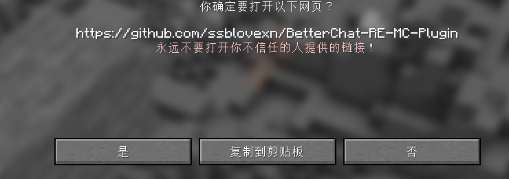

# 1.9新增功能
## 指令:reload
    重加载接入了ISave接口的组件(如GetName和GetPlayerTitle)
## 组件:GetAPI.GetPlayerTitle
    用于兼容米饭的称号插件，并扩展一部分
    可用/bc config GetAPI.GetPlayerTitle default [xxx]设置默认称号(支持16进制)
    可用/bc config GetAPI.GetPlayerTitle hover/click 设置称号悬浮事件与点击事件
## 变量:[Title]
    之前的  欢迎玩家[PlayerName]进入游戏可还熟悉？
    现在，hover也支持[Title]以替换玩家的称号了(可能有bug，但是不会是重大bug)

# BetterChat-RE-MC-Plugin
聊天增强插件 完全模块化，可以选择开启或者关闭某个功能(游戏内和config.yml都可以)

## 主要将聊天分为3个部分 
- GetAPI (玩家ID，称号信息等)
- OnReAPI (主要功能,聊天栏文本替换)
- FormatAPI （负责除了OnReAPI负责的部分以外的聊天栏部分,可以用此实现如渐变字体等聊天效果）

## 默认功能
- [item1-9] 展示对应物品栏物品
- [hand]/[hand2]展示主副手物品
- web链接 可以直接输入网址

#### 示例:

鼠标悬浮显示

点击网页后

## 1.9版本的config如下

    Save:
      open:
        Format: "none"
        GetAPI:
          - "GetName"
        OnReAPI:
          - "[hand]"
          - "[hand2]"
          - "[网页链接]"
          - "[item1-9]"
    GetName:
      format:
        - " <"
        - "> "
      hover: "#d9afd9点#d2b3da我#ccb7dbT#c5bcdbP#bfc0dcA#b8c4dd到#b1c8de玩#abccdf家#a4d1df位#9ed5e0置#97d9e1！"
      click: "/tpa [PlayerName]"
      #注：GetName包括GetName.format（除了click）都可以直接加彩色字体 ，这点是看扩展是否实现，并没有统一标准

    GetPlayerTitle:
          DefaultTitle: "#AAAAAA萌新"
          Hover: "#d9afd9点击打开称号背包"
          Click: "/plt open"
    #兼容称号并添加点击事件的API
### Save.Open记录开启状态的插件，持久化，下次开启服务器就不用再次进行设置
### !!GetAPI.GetPlayerTitle 默认不开启
##### 如果您安装了PlayerTitle插件，可以使用 

    /bc set GetAPI GetPlayerName true
## 游戏内管理指令:
### 展示目前开启和未开启的组件API(三种分类和ALL中选择)

    /bc list [搜索范围] 
    搜索范围必须有
### 设置插件状态

    /bc set [搜索范围] [组件API名称] [true/false]
### 设置接入了ConfigCommand注解的类，用于更改config（如GetAPI.GetName组件）

    /bc config [组件全称] ... 

## 重新加载(只影响实现了ISave接口的组件，如GetName和GetPlayerTitle)

    /bc reload

## 注:一切功能都基于API(甚至可以扩展子命令，本插件自带的3个指令(list,set,config)都是用插件中的API实现的，内置的只是少部分实现，以后会慢慢添加
未来可期，目前API比功能健壮
